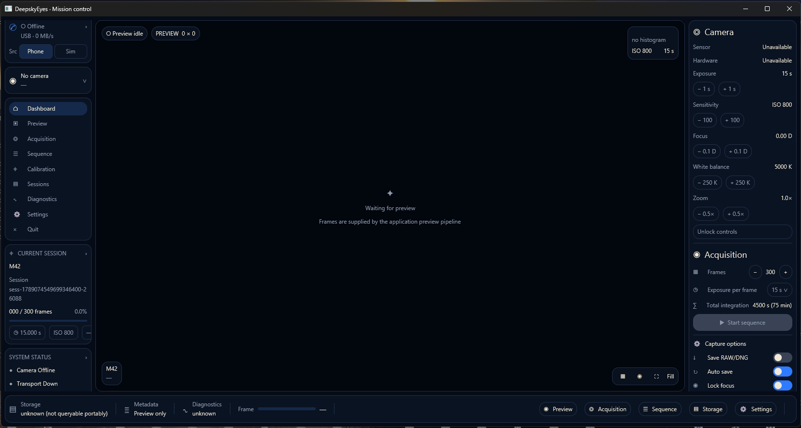
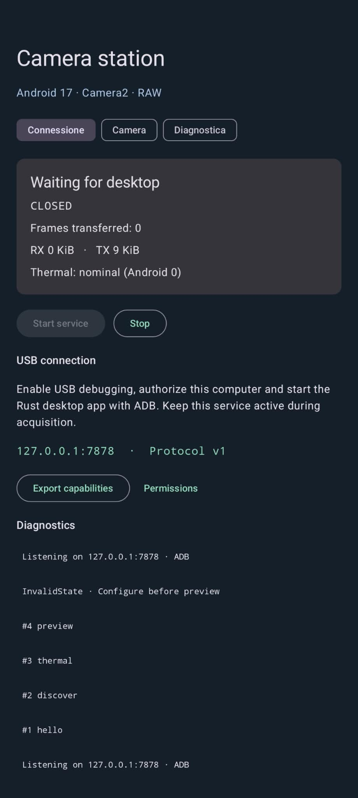

<p align="center">
  
</p>

<h1 align="center">DeepskyEyes</h1>

<p align="center"><b>Your Pixel as an astronomical camera, driven from your PC.</b></p>
<p align="center">Deep-sky astrophotography with the Google Pixel 8 Pro: PC-controlled RAW captures,<br/>over USB/ADB, with full manual control of every parameter.</p>

---

## What it is

DeepskyEyes turns a **Google Pixel 8 Pro** into a remotely controlled
deep-sky imaging instrument:

- the **phone** (Kotlin + Camera2 app) is the *camera station*: it discovers
  the sensor's real capabilities, runs RAW captures and streams them to the PC;
- the **PC** (Rust application) is *mission control*: it decides exposure,
  ISO, focus, white balance, sequences of hundreds of frames, storage,
  metadata and diagnostics.

A typical session: **300 × 15 s exposures = 75 minutes of integration**,
in RAW/DNG, with locked focus and fixed white balance, live preview on desktop.

> Project principle: **never assume a capability exists — discover it,
> validate it, expose it, and record what the hardware actually did.**
> Full specifications live in `AGENTS.md`; this file is the practical guide.

| Desktop (Rust) | Camera station (Android) |
|---|---|
|  |  |

---

## Features

- Real-capability discovery via `CameraCharacteristics` (never hard-coded values)
- **RAW/DNG** captures at full resolution (4080×3072) plus binned formats via RAW16
- Manual control: **exposure, ISO, focus (diopters), WB presets, zoom,
  crop, OIS/EIS, processing, frame duration**
- Sequences with pre-start validation, `session.json` manifest, SHA-256 checksums
- Live preview + one-shot autofocus whose value is reused as manual focus
- Transport-independent: **ADB** (development/production), TCP, simulator
- JPEG diagnostic mode / free-form requests for inspection

---

## Requirements

- **Phone**: Google Pixel 8 Pro, DeepskyEyes app installed, USB debugging
  authorized, Camera permission granted
- **PC**: Windows with `adb` (platform-tools), prebuilt Rust binaries in
  `Rust_App/target/release/` (`deepsky-eyes.exe`, `deepsky-app.exe`)
- USB cable between phone and PC

---

## 1. Android app (Kotlin) — the camera station

1. Install the APK (`Android_App`, `assembleDebug` build) and open it on the phone.
2. Grant the **Camera** permission when asked.
3. Go to the **Connection** tab and tap **Start service**.
   It switches to `Waiting for desktop` with `127.0.0.1:7878 · Protocol v1`.
4. Plug the phone into the PC over USB with USB debugging on and authorize the PC.

The service stays alive during acquisitions (foreground service): it does not
depend on the screen being on. The **Camera** tab can also shoot locally and
export DNGs; the **Diagnostics** tab shows state, RX/TX bytes and bridge logs.

> Quick start from the PC (brings the activity to the foreground; does not
> bypass lock screen or permissions):
>
> ```powershell
> adb -s 44101FDJG003S3 shell am start -n com.deepskyeyes.android/.MainActivity -a com.deepskyeyes.android.START_BRIDGE
> ```

---

## 2. Rust CLI — `deepsky-eyes.exe`

The exe lives in `Rust_App/target/release/deepsky-eyes.exe`.
Use `--source adb` (default) with `--serial ID` when several phones are attached;
`--source sim` opts into the synthetic simulator for phone-less testing.

### Inspect: discover what your Pixel can actually do

```powershell
$cli = 'E:\project-seri\DeepskyEyes\Rust_App\target\release\deepsky-eyes.exe'
& $cli discover                        # announced cameras (0 back, 1 front)
& $cli capabilities --camera 0         # rear camera capabilities (JSON)
& $cli capability_dump --out camera-inventory.json  # extended characteristics dump
& $cli ping; & $cli status; & $cli thermal
& $cli autofocus --camera 0            # one-shot AF, returns millidiopters
```

### Preview and single capture

```powershell
# Live preview saved as PNG
& $cli preview --camera 0 --exposure-ns 100000000 --sensitivity 100 --wb-preset daylight --out prev.png

# AF, then reuse its value as manual focus (recommended flow)
& $cli autofocus --camera 0
& $cli capture --camera 0 --project M42 --exposure-ns 1000000000 --sensitivity 800 --focus-mdiopt 508 --wb-preset daylight
```

### Deep-sky sequences

```powershell
# 30 light frames, 1 s, ISO 100, infinity focus, daylight WB
& $cli sequence --camera 0 --project M42 --kind light --frames 30 --exposure-ns 1000000000 --sensitivity 100 --focus-mdiopt 0 --wb-preset daylight --delay-ns 0

# Calibration darks (same exposure/ISO as the lights!)
& $cli sequence --camera 0 --project M42 --kind dark --frames 20 --exposure-ns 1000000000 --sensitivity 100 --focus-mdiopt 0 --wb-preset daylight

# Lightweight binned RAW16 instead of full-frame DNG
& $cli capture --camera 0 --project Fast --stream 2032x1536:Raw16Le --exposure-ns 100000000 --sensitivity 100 --wb-preset daylight
```

### All capture flags

| Flag | Camera2 | Notes |
|---|---|---|
| `--camera ID` | camera ID | `0` back, `1` front |
| `--stream WxH:FORMAT[:MODE]` | `ImageReader` format/size | exact announced match, e.g. `4080x3072:Dng`, `2032x1536:Raw16Le` |
| `--exposure-ns N` | `SENSOR_EXPOSURE_TIME`, AE OFF | max ~16 s main, ~1 s front |
| `--sensitivity N` | `SENSOR_SENSITIVITY` | announced range (e.g. 21..10666) |
| `--frame-duration-ns N` | `SENSOR_FRAME_DURATION` | must cover exposure + stream minimum |
| `--focus-mdiopt N` | AF OFF + `LENS_FOCUS_DISTANCE` | 1000 units = 1 diopter, `0` = infinity |
| `autofocus` / `preview --autofocus` | centered AF AUTO | returns distance to reuse with `--focus-mdiopt` |
| `--wb-preset NAME` | `CONTROL_AWB_MODE` | `daylight`, `shade`, `twilight`, … (**sequences require fixed WB, never `auto`**) |
| `--wb-kelvin N` | color temperature | unsupported by the current Pixel adapter |
| `--zoom RATIO` / `--zoom-x1000 N` | `CONTROL_ZOOM_RATIO` | e.g. `--zoom 2.0` |
| `--crop x,y,w,h` | `SCALER_CROP_REGION` | requested/reported rectangle |
| `--ois on\|off`, `--eis on\|off` | stabilization | requested/reported value |
| `--processing k=v,…` | edge, NR, hot-pixel, shading, … | each requested/reported mode |
| `--frames N`, `--delay-ns N` | PC-side sequence | frame count and inter-frame delay |
| `--project NAME`, `--kind light\|dark\|flat\|bias\|test`, `--out DIR` | session storage | manifests, filenames, checksums |
| `--strict-results` | observation gate | stops sequence on first non-conforming frame |

> Every parameter follows the **requested → applied → reported** model:
> if the phone clamps a value, you see it in the `.json` sidecar — never silently.

### Advanced diagnostics (free-form single request)

```powershell
& $cli request-template --camera 0 --stream 4032x3024:Jpeg --out request.json
# edit request.json using values announced by capabilities
& $cli execute --request request.json --out capture.jpg
& $cli session-inspect --path 'SESSION_PATH'
```

Default output: a `captures` folder next to the exe. Each session holds
`lights/`, `darks/`, `flats/`, `bias/`, `test/`, `metadata/` and `session.json`
(capability snapshot, thermal events, warnings, errors, per-frame SHA-256).

---

## 3. Desktop app (`deepsky-app.exe`)

GUI with live preview, camera/sequence/diagnostics panels and the same controls
as the CLI (shared `controller`). Headless mode for automation:

```powershell
& 'E:\project-seri\DeepskyEyes\Rust_App\target\release\deepsky-app.exe' --headless --out ./captures --project M42 --frames 10
```

---

## Repository layout

```text
DeepskyEyes/
├── README.md                  # this guide (practical usage)
├── AGENTS.md                  # full specifications (philosophy, architecture, protocol)
├── test.md / report.md        # test plan and dated observation reports
├── doc/                       # research (hardware, Camera2, RAW pipeline, …) + screenshots
│   ├── cli-control-reference.md
│   └── cli-regression.ps1     # automated verification on real hardware
├── Android_App/               # Kotlin + Camera2 camera station + ADB bridge (port 7878)
│   └── app/src/main/res/mipmap-*/ic_launcher.png
└── Rust_App/                  # Rust mission control
    ├── assets/logo.png, logo-rounded.png
    ├── resources/deepsky-eyes.ico, icon-256.png
    ├── target/release/deepsky-eyes.exe   # CLI
    ├── target/release/deepsky-app.exe    # desktop / headless
    └── crates/…               # protocol, transport, camera, acquisition, sequencer, …
```

---

## Known limitations (details in `report.md`)

- Science sequences: fixed white balance and locked focus are mandatory
  (`auto` is rejected with an explicit error).
- Android DNG at full resolution only: use `Raw16Le` for reduced sizes.
- Kelvin/temperature not exposed by the Pixel adapter; AE/ISO auto not implemented.
- No claim of universal Camera2 support: everything is validated on-device.

---

*Discover. Validate. Capture. Record everything. Assume nothing.*
